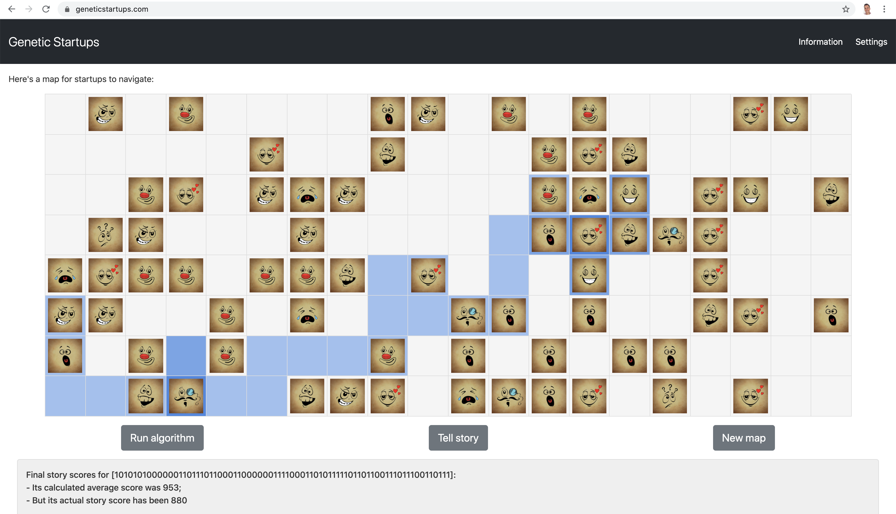

# Genetic Startups (Web)
> Ruby on Rails + React implementation of an application, based on Genetic Algorithms, representing possible lives 
of startups. The algorithm improves startup choices over generations, to achieve the most successful outcome possible; 
in a map where investors, product launches, team members, sad news and sales, among other options, appear.

## Introduction

This application, is running in [www.geneticstartups.com](https://www.geneticstartups.com). Further information on 
genetic algorithms, the problem of startup life choices; the map generation; the algorithm; the architecture; and the 
usage; can be found in the [info section](https://geneticstartups.com/info) of the site.

The algorithm improves choices over generations, trying to achieve the most successful outcome possible for the startup; 
in a map where investors, product launches, team members, sad news and sales, among other events, appear.

## Technical documentation

### Configuration

 * This project was created with: `rails new . --webpack=react`
 * The homepage controller was later created with: `rails g controller pages home`
 * Jest was installed running: `bin/yarn add jest babel-jest` 

### Running tests

 * Seems it is necessary to run `rails db:migrate` prior to the tests (or disable the DB config).
 * Then, run: `rails test`
     * Can also run tests in specific files: `rails test <test_file.rb>` (e.g. `rails test test/models/map_model_test.rb`)
 * To run React/JS tests: `bin/yarn test`

### Deploying it

#### Locally for development
`rails s`

#### In a container
 * First build it:  `docker build -t <imageName> .`
 * Then run it: `docker run -p 3000:3000 <imageName>`
    * Running in background and redirecting logs example:
      `nohup docker run -p 3000:3000 romenrg/geneticstartups:0.0.1 > ../logs/logs.log 2>&1 & disown`
      
## Contribute

Any constructive contributions (i.e. PRs or issues) are welcome. Please feel free to propose changes following 
[the contributing guideline](CONTRIBUTING.md).